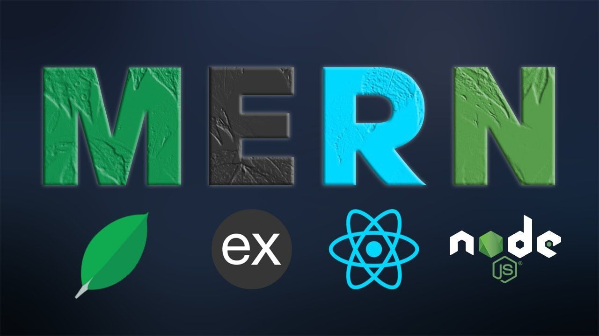

# BUTTERFLY BATTERY

- START FRONTEND: cd client/ - npm start
- START BACKEND: cd server/ - npm start
- START CYPRESS: 
    * npm run cy:client
    * npm run cy:deployed
    * npm run cy:server

More info coming soon...

## Technologies Used:
* React
* Express
* MongDB
* Node.js

<!-- 🛠 Built with [React][reactjs], [Express][express], [MongoDB][mongodb], [Material-UI][material-ui], [node][nodejs], and [javaScript][javaScript] -->

### Expected
- [X] Activity
- [ ] Authentication
- [ ] CRUD
- [X] Hashtags
- [ ] Journal
- [X] Likes
- [ ] Ratings
- [ ] e2e Testing

## Cypress Tests
Click here to see my Cypress Tests! => 